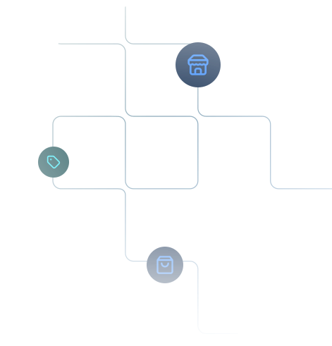

# 🚀 Site.Set - NextJS Blog

<div align="center">
  
  
  [](https://nextjs.org/)
  [](https://reactjs.org/)
  [](https://www.typescriptlang.org/)
  [](https://tailwindcss.com/)
  [](https://contentlayer.dev/)
  
  <br/>
  
  **Um projeto de estudo da nova trilha de NextJS da Rocketseat** 🎓
  
  [Demo](#) · [Documentação](#tecnologias) · [Contribuir](#como-contribuir)
</div>

---

## 📖 Sobre o Projeto

O **Site.Set** é uma plataforma completa para criação de lojas virtuais e blog, desenvolvida como projeto de estudo focado nos **fundamentos de NextJS** da nova trilha da Rocketseat. O projeto demonstra conceitos essenciais e modernos de desenvolvimento web utilizando o App Router do Next.js 13+ e as melhores práticas da comunidade.

### ✨ Funcionalidades

- 🏠 **Landing Page** - Interface moderna e responsiva
- 📝 **Sistema de Blog** - Gerenciamento de conteúdo com Contentlayer
- 🎨 **Design System** - Componentes reutilizáveis com Radix UI
- 📱 **Responsivo** - Adaptado para todos os dispositivos
- ⚡ **Performance** - Otimizado com Next.js 15
- 🔍 **SEO** - Metadados e OpenGraph configurados
- 🎯 **TypeScript** - Tipagem completa para maior segurança

---

## 🛠 Tecnologias

Este projeto foi desenvolvido com as seguintes tecnologias:

### Core
- **[Next.js 15.4.6](https://nextjs.org/)** - Framework React com App Router
- **[React 19.1.0](https://reactjs.org/)** - Biblioteca para interfaces de usuário
- **[TypeScript 5.0](https://www.typescriptlang.org/)** - Superset JavaScript com tipagem estática

### Styling & UI
- **[Tailwind CSS 3.4.17](https://tailwindcss.com/)** - Framework CSS utility-first
- **[Radix UI](https://www.radix-ui.com/)** - Componentes acessíveis e sem estilo
- **[Lucide React](https://lucide.dev/)** - Ícones SVG customizáveis
- **[Class Variance Authority](https://cva.style/)** - Utilitário para variantes de componentes

### Content Management
- **[Contentlayer 0.3.4](https://contentlayer.dev/)** - Processador de conteúdo type-safe
- **[React Markdown](https://github.com/remarkjs/react-markdown)** - Renderizador de Markdown
- **[Remark GFM](https://github.com/remarkjs/remark-gfm)** - Suporte para GitHub Flavored Markdown

### Development Tools
- **[ESLint](https://eslint.org/)** - Linter para JavaScript/TypeScript
- **[PostCSS](https://postcss.org/)** - Processador CSS
- **[PNPM](https://pnpm.io/)** - Gerenciador de pacotes rápido e eficiente

---

## 🚀 Como Executar

### Pré-requisitos

- [Node.js](https://nodejs.org/) (versão 18+)
- [PNPM](https://pnpm.io/) (recomendado) ou NPM/Yarn

### Instalação

1. **Clone o repositório**
   ```bash
   git clone https://github.com/tavareshenrique/nextjs.git
   cd site-blog
   ```

2. **Instale as dependências**
   ```bash
   pnpm install
   ```

3. **Execute o projeto em modo de desenvolvimento**
   ```bash
   pnpm dev
   ```

4. **Abra o navegador em** [http://localhost:3000](http://localhost:3000)

### Scripts Disponíveis

- `pnpm dev` - Inicia o servidor de desenvolvimento
- `pnpm build` - Gera build de produção
- `pnpm start` - Inicia o servidor de produção
- `pnpm lint` - Executa o linter
- `pnpm contentlayer:build` - Processa o conteúdo do Contentlayer

---

## 📁 Estrutura do Projeto

```
site-blog/
├── 📁 src/
│   ├── 📁 app/                 # App Router (Next.js 13+)
│   │   ├── layout.tsx         # Layout principal
│   │   ├── page.tsx           # Página inicial
│   │   └── blog/              # Rotas do blog
│   ├── 📁 components/         # Componentes reutilizáveis
│   │   ├── ui/                # Componentes base (Radix UI)
│   │   ├── layout/            # Componentes de layout
│   │   └── ...                # Outros componentes
│   ├── 📁 templates/          # Templates de páginas
│   ├── 📁 hooks/              # Custom hooks
│   └── 📁 lib/                # Utilitários e configurações
├── 📁 posts/                  # Arquivos markdown dos posts
├── 📁 public/                 # Arquivos estáticos
├── contentlayer.config.ts     # Configuração do Contentlayer
└── ...                        # Arquivos de configuração
```

---

## 🎨 Design System

O projeto utiliza um design system baseado em:

- **Tokens de Design** - Cores, espaçamentos e tipografia consistentes
- **Componentes Compostos** - Padrão de composição para flexibilidade
- **Variantes de Componentes** - Sistema de variantes com CVA
- **Acessibilidade** - Componentes acessíveis com Radix UI

### Exemplo de Uso

```tsx
import { Avatar } from '@/components/avatar'

export function UserProfile() {
  return (
    <Avatar.Container>
      <Avatar.Image src="/avatar.jpg" alt="Usuário" />
      <Avatar.Content>
        <Avatar.Title>Henrique Tavares</Avatar.Title>
        <Avatar.Description>Desenvolvedor Frontend</Avatar.Description>
      </Avatar.Content>
    </Avatar.Container>
  )
}
```

---

## 📝 Gerenciamento de Conteúdo

O blog utiliza o **Contentlayer** para processar arquivos Markdown de forma type-safe:

```yaml
---
title: "Título do Post"
description: "Descrição do post"
date: "2025/09/01 07:25:00"
image: "/assets/post-image.png"
author:
  name: "Henrique Tavares"
  avatar: "/avatar.png"
---

Conteúdo do post em Markdown...
```

---

## 🤝 Como Contribuir

1. Faça um fork do projeto
2. Crie uma branch para sua feature (`git checkout -b feature/AmazingFeature`)
3. Commit suas mudanças (`git commit -m 'Add some AmazingFeature'`)
4. Faça push para a branch (`git push origin feature/AmazingFeature`)
5. Abra um Pull Request

---

## 📚 Aprendizado

Este projeto foi desenvolvido como parte dos estudos dos **fundamentos de NextJS** da nova trilha da **Rocketseat**, explorando:

- ⚡ App Router do Next.js 13+
- 🏗️ Arquitetura de componentes escalável
- 📄 Sistema de gerenciamento de conteúdo
- 🎨 Design system consistente
- 🔍 SEO e performance otimizados
- 📱 Responsividade e acessibilidade
- 🎯 Fundamentos sólidos do Next.js

---

## 👨‍💻 Autor

**Henrique Tavares**

- LinkedIn: [Henrique Tavares](https://linkedin.com/in/tavareshenrique)
- GitHub: [@tavareshenrique](https://github.com/tavareshenrique)
- Email: ihenrits@gmail.com

---

## 📄 Licença

Este projeto está sob a licença MIT. Veja o arquivo [LICENSE](LICENSE) para mais detalhes.

---

<div align="center">
  <p>Feito com ❤️ por Henrique Tavares</p>
  <p>Projeto de estudo dos <strong>fundamentos de NextJS</strong> da trilha da <strong>Rocketseat</strong> 🚀</p>
</div>
